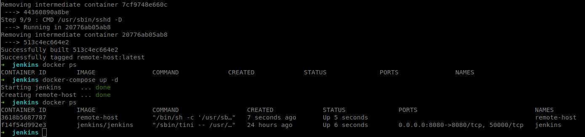
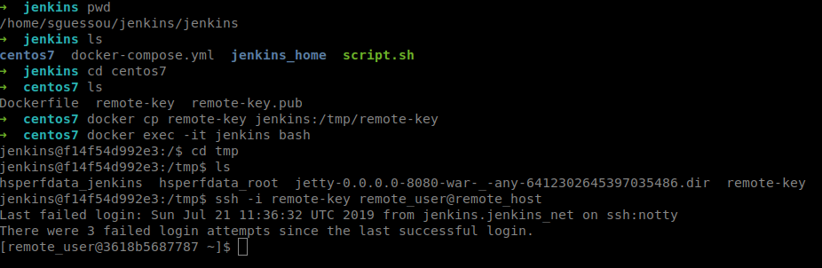
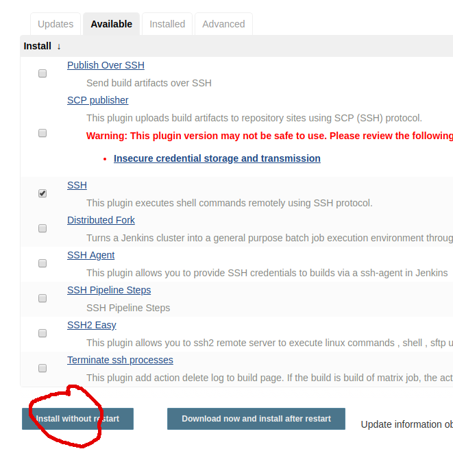
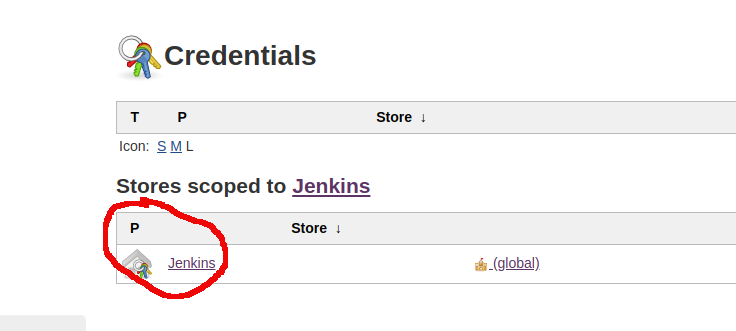
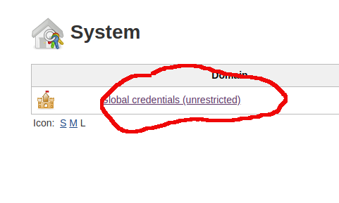
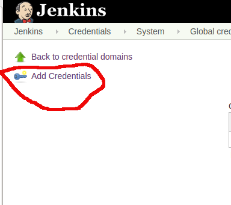
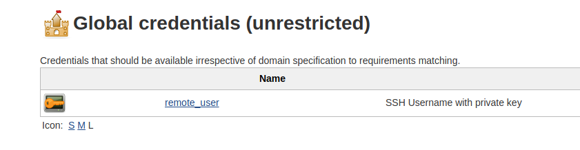

# Docker + Jenkins + SSH

We will be running a separate container running Centos7.
Create a separate directory (e.g. centos7). We will use a Dockerfile to configure the container.

We need an ssh key for the remote user, lets generate one inside the centos7 directory:
```
$ ssh-keygen -f remote-key
```
Dockerfile:         
```
# Dockerfile
FROM centos

# Install ssh server
RUN yum -y install openssh-server

# Create user `remote_user` with assigned password 
RUN useradd remote_user && \
    echo "return0" | passwd remote_user --stdin && \
    mkdir /home/remote_user/.ssh && \
    chmod 700 /home/remote_user/.ssh
    
COPY remote-key.pub /home/remote_user/.ssh/authorized_keys

# Change ownership of .ssh directory and mode of .ssh key
RUN chown remote_user:remote_user -R /home/remote_user/.ssh/ && \
    chmod 600 /home/remote_user/.ssh/authorized_keys

# Create global ssh keys for container
RUN /usr/sbin/sshd-keygen

# start the ssh service    
CMD /usr/sbin/sshd -D            
```
Lets update our docker-compose file and add the remote container as a new service:
```
version: '3'
services:
    jenkins:
        container_name: jenkins
        image: jenkins/jenkins
        ports:
         - "8080:8080"
        volumes:
         - "$PWD/jenkins_home:/var/jenkins_home"
        networks:
         - net
    remote_host:
        container_name: remote-host
        image: remote-host
        build:
            context: centos7
        networks:
         - net
networks:
    net:
      driver: bridge
```    
Build the image with the following command:
```
$ docker-compose build
```        
When the build is done, launch the build with the `docker-compose up -d` command. We should end up with both containers running:


Lets test ssh connecting to the remote container from the jenkins container. We will first copy the ssh key to the jenkins container using this command: `docker cp remote-key jenkins:/tmp/remote-key`.             
We will then bash into the jenkins container: `docker exec -it jenkins bash` and ssh into the remote server using this command: `ssh -i remote-key remote_user@remote_host`     


Next step is the installation of the ssh plugin in Jenkins in order to enable ssh connection:

Restart Jenkins after the installation completes.

Before the ssh configuration we need to create new credentials for the remote host's ssh key:



  
        
            
Click on the `Manage Jenkins` from left menu, then click on the `Configure System` option, after that configure the ssh option:
         
            
            
            
    
       