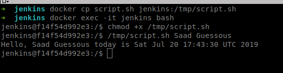
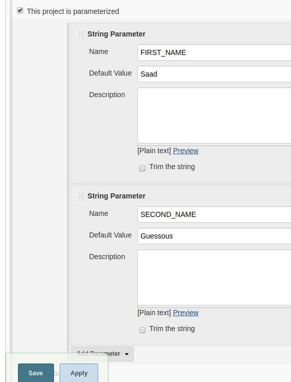
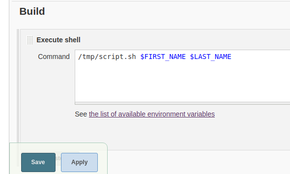
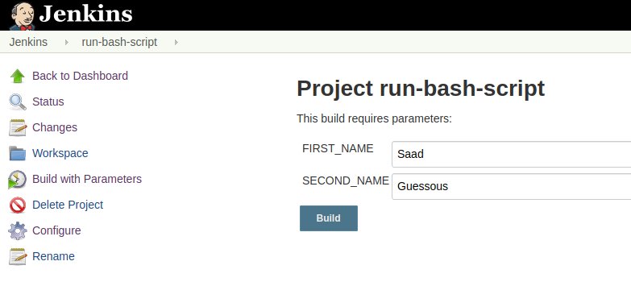
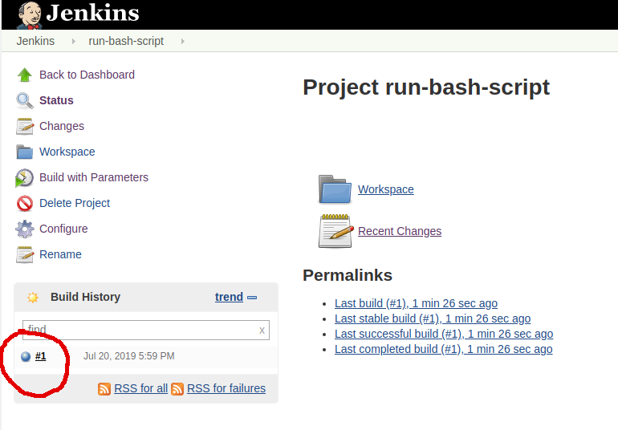
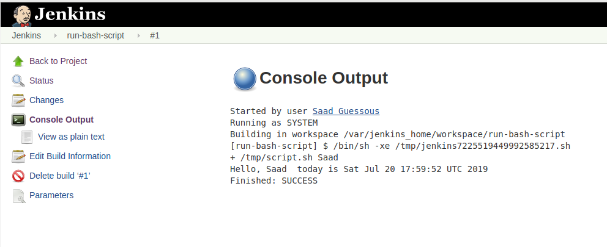

# Run a BASH Script from Jenkins

In this article we will demonstrate how to run a Bash script from Jenkins.  
Our Bash script will be expecting some parameters that we will define while creating the job in Jenkins.   

The Bash script looks as follow:
```
#!/bin/bash

NAME=$1
LASTNAME=$2
DATE=$(date)
echo "Hello, $NAME $LASTNAME today is $DATE"
```
The script expects two string parameters (NAME + LASTNAME) and print them back with the current date.

Next, we run the following commands to copy and test the bash script in the container:     
```
# Copy the script from the host into the container
$ docker cp script.sh jenkins:/tmp/script.sh

# Bash into the container
$ docker exec -it jenkins bash

# Make the script executable
[container]$ chmod +x /tmp/script.sh

# Test the script
[container]$ /tmp/script.sh Saad Guessous                    
```
    

Now it's time to create our Jenkins job and configure the parameters for the Bash script.

Name and create a freestyle project:


We configure two string parameters with default values:


We configure the Jenkins shell to run the bash script:


Build the project:


Check the build result:

                    