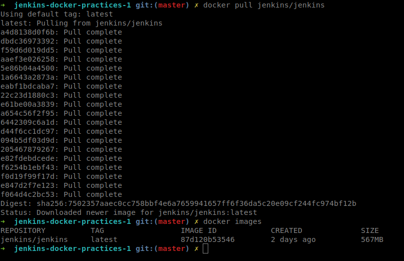
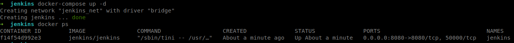
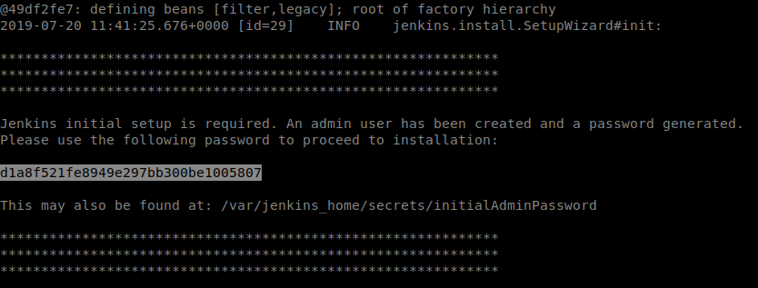
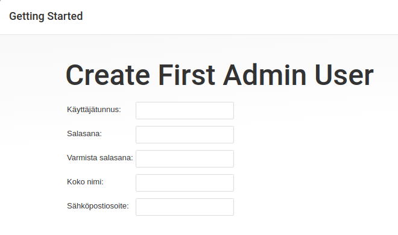

# Dockerizing Jenkins

We will start by downloading the latest image of Jenkins using docker.
```
$ docker pull jenkins/jenkins    
```
The image will start downloading, when the download finishes you can list the image with this command:
```
$ docker images        
```


To configure our Jenkins containers we well use docker compose tool.
Our YAML configuration file (docker-compose.yml) looks like the following:
```
version: '3'
services:
    jenkins:
        container_name: jenkins
        image: jenkins/jenkins
        ports:
         - "8080:8080"
        volumes:
         - "$PWD/jenkins_home:/var/jenkins_home"
        networks:
         -net
networks:
    net:
      driver: bridge        
```
In the above configuration file we are building Jenkins from the downloaded image (jenkins/jenkins).
A local directory should be created at the root of the project (jenkins_home). That directory is mounted and can be used by the container.
Finally host port 8080 is mapped to same port on the container.

Run the container in detached mode (background) with this command:
```
$ docker-compose up -d
```


To finalize the Jenkins installation we will need to grab the administrator password from the running container's logs.
To access the logs run this command:
```
$ docker logs -f jenkins    
```
     
    
Go to localhost:8080 and start the installation process by pasting in the administrator password.

            

Choose the "Install suggested plugins" option.   

          

Create your admin user.   

        

Welcome to Jenkins!        


                  

               